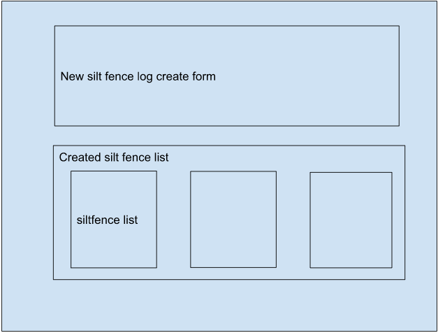
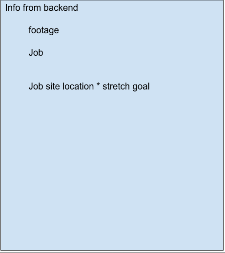

# cb-construction-frontend

## Table of Contents

- [Node list](#node-list)
- [Team Collaborators](#team-collators)
- [Instructions for running](#instructions-for-running)
- [Approach taken](#approach-taken)
- [Unsolved problems](#unsolved-problem)
- [Notes for later](#notes-for-latter)
- [User stories](#user-stories)
- [Wire framework](#wire-framework)
- [Live link](#live-link)
- [Stretch goals](#stretch-goals)

## Node list

- axios

- react bootstrap

- sass

- Install project with
  ```sh
      npm i
  ```

## Team collaborators

- Elijah Early

- Sydney Clark

- Bailey Rechkemmer

## Instruction for running

1. after cloning down from git hub make sure your node is running the right version (node v19.4.0) and run nmp i to install all thing needed to run this application

2. type in terminal npm start make sure your back end is running first

## Approach taken

- we started by making a model with the 2 felids that are the main data we need. then went through and made it meet mvp. we then started to add things to it like user authentication and able to log more thing than just the silt fence stuff.

## Unsolved problems

- cards are not the the same hight {x}

-

## Notes for latter

- we want to add things to the input form for other jobs on the site like street sweepings, machinery used, and people that worked on the job.

## User stories

- As a user I should be able to enter the footage used on the job.

- As a user I should be able to log the job site name.

- As a user i should be able to see cards of what i have made

- As a user i should be able to delete cards that i chose

- As a user i should be able to edit the cards info

## Wire Framework




## Live link

- backend - https://cb-construction-backend.onrender.com/
- frontend -

## Stretch goals

- Adding google locations {}

- User login and authentication {}

- Adding other cards for other work {}

- Adding icons {}
